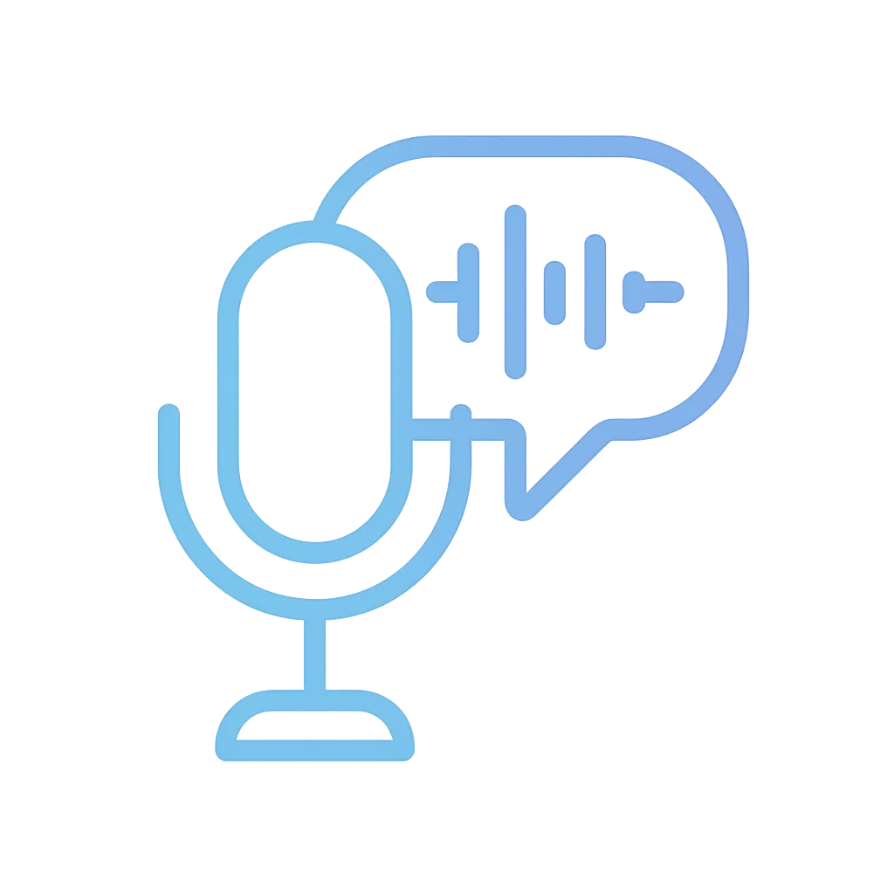

<p align="center">
  
</p>

# Whisper WebUI

一个使用 Next.js 构建的 Groq Whisper API 字幕转换工具，提供现代化的操作界面和中英文双语体验。

## 功能特点

- 拖拽或点击上传音频文件，实时请求 Groq Whisper API。
- 支持选择模型、手动指定转录语言、切换界面语言。
- 转录结果自动转换为 SRT，支持复制或下载。
- 进度提示、操作通知与错误弹窗，交互体验友好。

## 本地开发

```bash
npm install
npm run dev
```

打开浏览器访问 [http://localhost:3000](http://localhost:3000) 即可预览界面。

## 许可证

MIT
